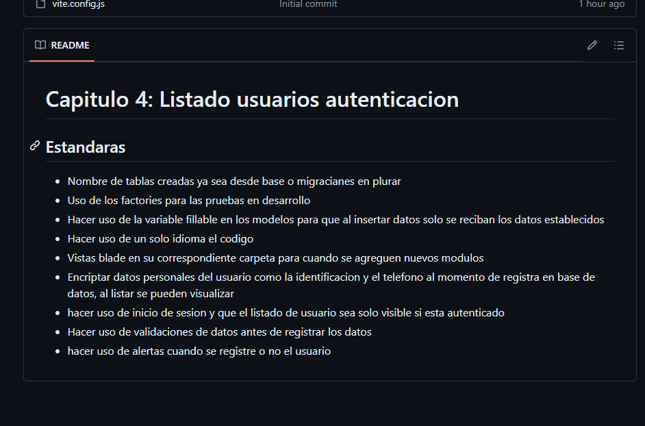
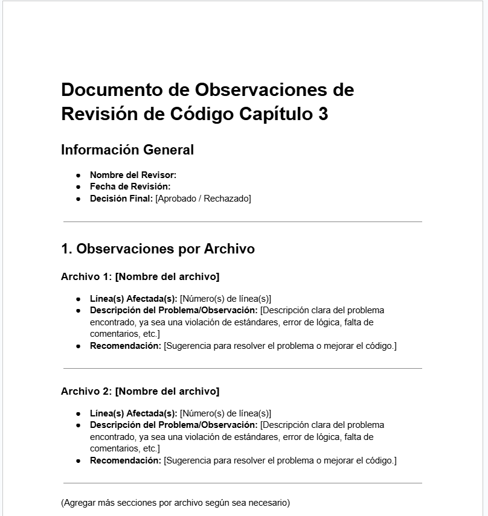

# Práctica 4. Seguridad del código

## Objetivo de la práctica:
Al finalizar la práctica, serás capaz de:
- Identificar vulnerabilidades.
- Evaluar el cumplimiento de estándares de seguridad.

## Objetivo Visual: 

## Duración aproximada:
- 20 minutos.

## Tabla de ayuda:

| Requisito | Descripción|
| --- | --- |
| Repositorio de GitHub | Acceso al repositorio [Netec cap4](https://github.com/mfperdomo09/netec-cap4.git). |
| GitHub Account | Cuenta activa para acceder al repositorio y revisar pull requests. |
| Repositorio Clonado Localmente | Clonar el repositorio localmente para una revisión más detallada si es necesario. |
| Documento de Evaluación | Herramienta para documentar las observaciones (puede ser un archivo de texto o similar). Formato en sección documentos correspondiente a este capítulo. |

## Instrucciones:

### Tarea 1. Descripción de la tarea a realizar.
Paso 1. Accede al repositorio para la actividad del capítulo.

En el README podrás visualizar una lista de estándares a seguir en el código.

**Paso 2.** Ingresa a la sección de **"Pull request"**.

Selecciona el pull request activo.

**Paso 3.** En la sección de **"Files changed"**, revisa los archivos modificados para ver si cumplen con los estándares establecidos.

**Paso 4.**  Identifica los errores encontrados, ya sea que no cumplen con los estándares establecidos y de seguridad de datos.

### Resultado esperado:

En un documento establece si aprobarías el pull request, de no ser así, comentar los motivos, señalando en dónde no se cumplieron los estándares y cómo esto podría afectar la seguridad de la información y la calidad del código.

 
[Inicio](../README.md) 
[Práctica 3. Revision básica de código](../Capítulo3/README.md) 
[Práctica 5. Cómo se realiza una revisión del código.](../Capítulo5/README.md) 
