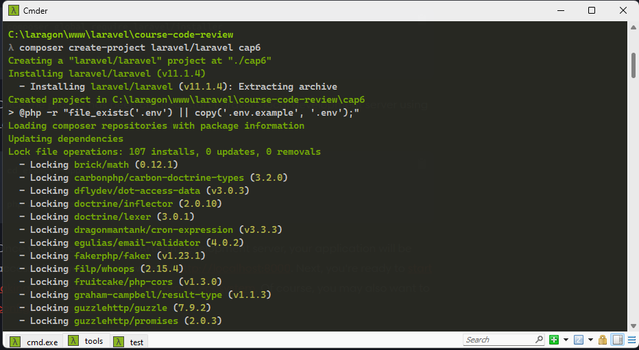
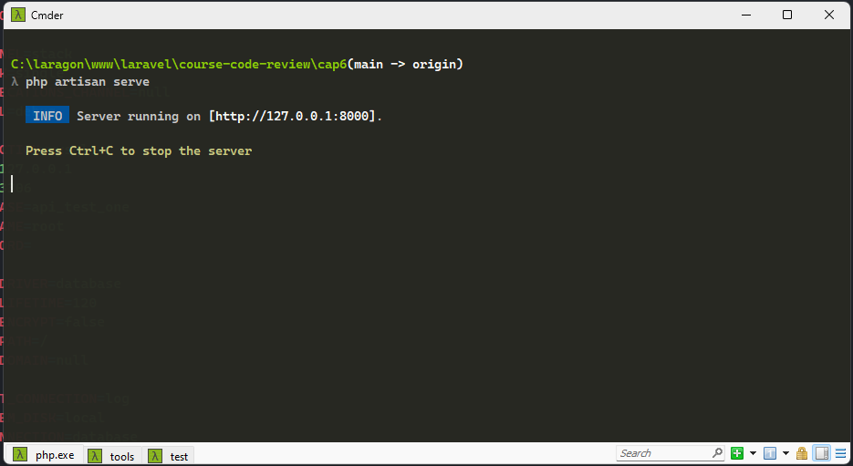
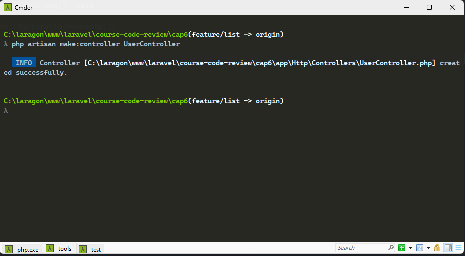
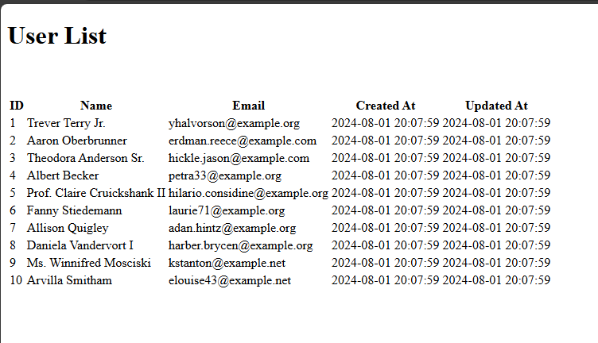

# Práctica 6. Programación en pares

## Objetivo de la práctica:
Al finalizar la práctica, serás capaz de:
- Desarrollar habilidades de programación en pares.

## Objetivo Visual: 


Imagen de Codio, 25 de agosto 2021 [Codio](https://www.codio.com/blog/3-collaborative-coding-practices-pair-programming-peer-instruction)

## Duración aproximada:
- 26 minutos.

## Tabla de ayuda:

| Requisito | Descripción|
| --- | --- |
| GitHub Account | Cuenta activa para acceder al repositorio y revisar pull requests. |
| GitHub Desktop | Herramienta opcional para clonar y gestionar el repositorio localmente. |
| Laragon | Herramienta para iniciar servicios de PHP, Apache y MySQL. |
| Composer | Utilizado para instalar Laravel y sus dependencias. Incluido en Laragon. |
| Editor de Código | Recomendado para modificar archivos (ej. Visual Studio Code). |
| Terminal/Comando CLI | Necesario para ejecutar comandos de Git y Laravel. |
| PHP8 y MySQL | Lenguaje y base de datos utilizados en el proyecto Laravel. Incluidos en Laragon. |

## Instrucciones: 

**Paso 1.** Para iniciar, desde Laragon inicia los servicios de MySQL para base de datos y Apache.


**Paso 2.** Desde la terminal en la carpeta www correspondiente a Laragon, ejecuta el siguiente comando de composer: `composer create-project laravel/laravel nombre-poryecto` y espera hasta que finalice.

        composer create-project laravel/laravel nombre_proyecto




**Paso 3.** Ingresa al proyecto y, dentro del archivo *.env*, descomenta las líneas 23 a la 27 y en la línea 22 cambia el valor a MySQL.

## .env
```
    DB_CONNECTION=mysql
    DB_HOST=localhost
    DB_PORT=3306
    DB_DATABASE=laravel
    DB_USERNAME=root
    DB_PASSWORD=
```


**Paso 4.**  En GitHub Desktop, agrega el proyecto.


Como este proyecto no se inicializó en Git, da clic en **"Create a repository"**.


Establece la información necesaria, en este caso con el nombre es sufuciente.


Una vez agregado puedes publicar el repositorio en tu cuenta.

**Paso 5.**  En la terminal, ingresa el comando `php artisan serve`.

        php artisan serve



Esto hará que se inicie un servicio local donde podrás hacer uso de la URL que te genera, da `CTRL + clic`, el cual abrirá el navegador y permitirá visualizar la presentacion de Laravel.

**Paso 6.** Dentro del proyecto busca el archivo *"UserFactory"* en la ruta **"database/factories"**.


Verifica que el código sea el mismo, esto con el fin de generar datos de prueba en la base de datos.

**Paso 7.** Ahora, en la ruta **"database/seeders"**, busca el archivo *"DatabaseSeeder.php"*.

## DatabaseSeeder.php
```php
    <?php

    namespace Database\Seeders;

    use App\Models\User;
    // use Illuminate\Database\Console\Seeds\WithoutModelEvents;
    use Illuminate\Database\Seeder;

    class DatabaseSeeder extends Seeder
    {
        /**
         * Seed the application's database.
         */
        public function run(): void
        {
            User::factory(10)->create();
        }
    }
```


Desconecta la línea `User::Factory` y elimina el resto.

**Paso 8.** Corre las migraciones con los seeders para crear la base de datos e inserta los datos `php artisan migrate --seed`.

        php artisan migrate --seed

Al ser la primera vez con este proyecto te preguntará si se debe crear una base de datos ya que no existe, de tal forma, selecciona:

        yes


Preguntará si quieres crear la base de datos, escribe `yes` y da **Enter**.

**Paso 9.** Realiza commit de los cambios y push para que suban al repositorio remoto.


**Paso 10.** Crea una rama donde crearás un listado de los usuarios.


Después de crearla, publícala.


**Paso 11.** Usa el comando `php artisan make:controller UserController`, esto creará un archivo controller en la ruta **"app/Http/Controllers"**
donde podrás crear los métodos correspondientes.

        php artisan make:controller UserController



**Paso 12.** En el archivo controller que creaste, escribe el método index, donde primero deberás traer todos los registros de la tabla usuario, luego retonamos la vista la cual estaria en la ruta **"views/user/"** junto con todo los registro de usuarios.

```php
    <?php

    namespace App\Http\Controllers;

    use App\Models\User;
    use Illuminate\Http\Request;

    class UserController extends Controller
    {
        public function index()
        {
            $users = User::all();

            return view('user.index', compact('users'));
        }
    }
```


**Paso 13.** Ingresa al archivo *"web.php"*, el cual es el archivo de rutas o urls de accesso que generaste.


```
    Route::get('/', [UserController::class, 'index']);
```


La ruta que se encuentra ahí, debes modificarla para que no reciba una función sino un array con dos items: primero el controlador de usuario y el método que llamará esa ruta, en este caso, el método index.

**Paso 14.** Luego en la ruta de carpetas **"resource/views/"**, crea una carpeta **"user"** y, dentro de ésta, un archivo llamado **"index.blade.php"**.


De esta foma, observa que concuerda con la ruta que se estableció en el controlador **"user.index"**.

**Paso 15.** En el archivo index, crea la siguiente estructura HTML5 donde, por medio de un foreach, recorre la colección de registros que enviaste del controlador.

## views/user/index.blade.php
```html
    <!DOCTYPE html>
    <html lang="en">
    <head>
        <meta charset="UTF-8">
        <meta name="viewport" content="width=device-width, initial-scale=1.0">
        <meta http-equiv="X-UA-Compatible" content="ie=edge">
        <title>Users</title>
    </head>
    <body>
    
        <h1>User List</h1>
    
        <br>
        <br>
    
        <table>
            <thead>
                <tr>
                    <th>ID</th>
                    <th>Name</th>
                    <th>Email</th>
                    <th>Created At</th>
                    <th>Updated At</th>
                </tr>
            </thead>
    
            <tbody>
                @foreach ($users as $user)
                    <tr>
                        <td>{{$user->id}}</td>
                        <td>{{$user->name}}</td>
                        <td>{{$user->email}}</td>
                        <td>{{$user->created_at}}</td>
                        <td>{{$user->updated_at}}</td>
                    </tr>
                @endforeach
            </tbody>
        </table>
    
    </body>
    </html>
```


**Paso 16.** Finalmente, desde el navegador recarga la página y observa que carga el listado de usuarios registrados.


### Resultado final:

<br>
[Inicio](../README.md)<br>
[Práctica 5. Cómo se realiza una revisión del código.](../Capítulo5/README.md)<br>
[Práctica 7. Configuración de la herramienta revisión de código](../Capítulo7/README.md)<br>

