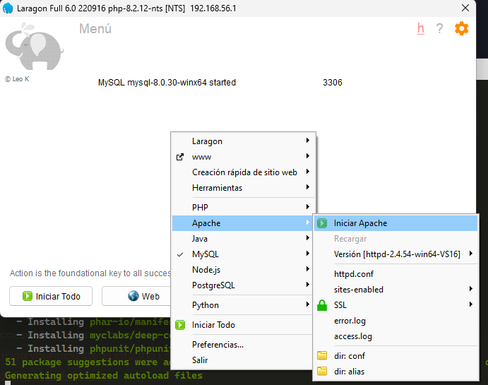
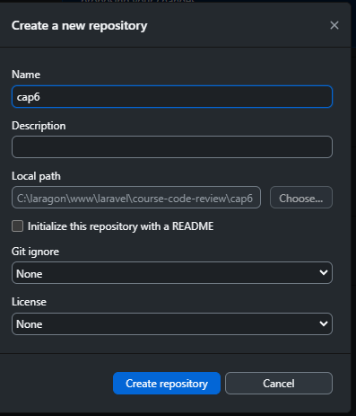
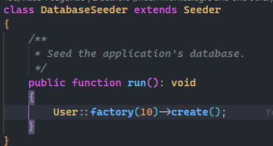
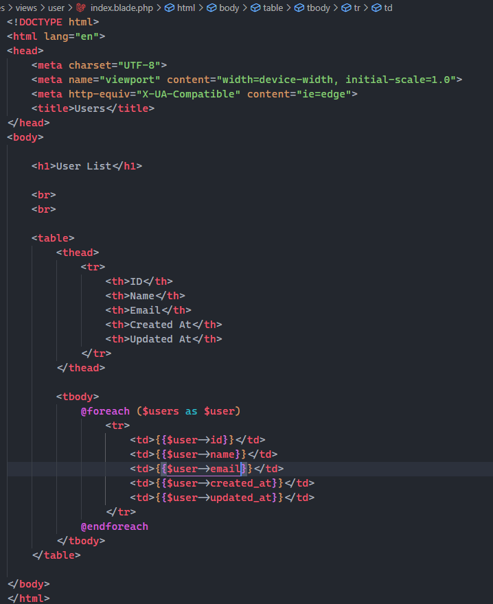

# Capitulo 6: Programación en pares

## Objetivo de la práctica:
Al finalizar la práctica, serás capaz de:
- Desarrollar habilidades de programación en pares

## Objetivo Visual 
Crear un diagrama o imagen que resuma las actividades a realizar, un ejemplo es la siguiente imagen. 


Imagen de Codio, 25 de agosto 2021, [Codio](https://www.codio.com/blog/3-collaborative-coding-practices-pair-programming-peer-instruction)

## Duración aproximada:
- 26 minutos.

## Tabla de ayuda:
Agregar una tabla con la información que pueda requerir el participante durante el laboratorio, como versión de software, IPs de servers, usuarios y credenciales de acceso.
| Requisito | Descripcion|
| --- | --- |
| GitHub Account | Cuenta activa para acceder al repositorio y revisar pull requests. |
| GitHub Desktop | Herramienta opcional para clonar y gestionar el repositorio localmente. |
| Laragon | Herramienta para iniciar servicios de PHP, Apache y MySQL. |
| Composer | Utilizado para instalar Laravel y sus dependencias. Incluido en laragon |
| Editor de Código | Recomendado para modificar archivos (ej. Visual Studio Code). |
| Terminal/Comando CLI | Necesario para ejecutar comandos de Git y Laravel. |
| PHP8 y MySQL | Lenguaje y base de datos utilizados en el proyecto Laravel. Incluidos en laragon |

## Instrucciones 
<!-- Proporciona pasos detallados sobre cómo configurar y administrar sistemas, implementar soluciones de software, realizar pruebas de seguridad, o cualquier otro escenario práctico relevante para el campo de la tecnología de la información -->
### Tarea 1. Descripción de la tarea a realizar.

Paso 1. Primero desde laragon iniciamos los servicios de mysql para base de datos y apache




Paso 2. Desde la terminal en la carpeta www correspondiente a laragon ejecutamos el siguiente comando de composer "composer create-project laravel/laravel nombre-poryecto", esperamos hasta que finalice.

        composer create-project laravel/laravel nombre_proyecto


Paso 3. Ingresamos al proyecto y dentro del archivo .env descomentamos las lineas 23 a 27, en la linea 22 cambiamos el valor a mysql

## .env
```
    DB_CONNECTION=mysql
    DB_HOST=localhost
    DB_PORT=3306
    DB_DATABASE=laravel
    DB_USERNAME=root
    DB_PASSWORD=
```


Paso 4.  En github desktop agremamos el proyecto


Como es proyecto no se inicializo en git vamos a dar click en "create a repository"



Establecemos la informacion necesaria, en este caso con solo el nombre es sufuciente


Ya agregado podemos publicar el repositorio en nuestra cuenta

Paso 5.  En la terminal ingresamos el comando "php artisan serve"

        php artisan serve


Esto hara que se inicie un servicio local donde podremos hacer uso de la url que nos genera, dando "ctrl + click" a este nos abrira el nagedor y permitira visualizar la presentacion de laravel

Paso 6. Dentro del proyecto buscamos el archivo "UserFactory" en la ruta "database/factories"


Verificamos que el codigo sea el mismo, esto con el fin para generar datos de prueba en la base de datos

Paso 7. Ahora en la ruta "database/seeders" bucamos el archivo "DatabaseSeeder.php"

## DatabaseSeeder.php
```php
    <?php

    namespace Database\Seeders;

    use App\Models\User;
    // use Illuminate\Database\Console\Seeds\WithoutModelEvents;
    use Illuminate\Database\Seeder;

    class DatabaseSeeder extends Seeder
    {
        /**
         * Seed the application's database.
         */
        public function run(): void
        {
            User::factory(10)->create();
        }
    }
```




Descomentamos la linea User::Factory y elinamos el restos

Paso 8. Corremos las migraciones con los seeders para crear la base de datos e insertar los datos "php artisan migrate --seed"

        php artisan migrate --seed
Al ser la primera vez con este proyecto nos preguntara si creamos una base de datos ya que no existe, damos:

        yes


Nos preguntara si queremos crear la base de datos, escibimos "yes" y damos enter

Paso 9. Hacemos commit de los cambios y push para que suban al repositorio remoto


Paso 10. Creamos una rama donde crearemos un listado de los usuarios


Despues de creada la publicamos


Paso 11. Usamos el comando "php artisan make:controller UserController", esto creara un archivo controllador en la ruta "app/Http/Controllers"
donde podremos crear los metodos correspondientes.

        php artisan make:controller UserController


Paso 12. En el archivo contrlador que creamos, escribiremos el metodo index, donde primero traemos todos los registros de la tabla usuario, luego retonamos la vista la cual estaria en la ruta "views/user/" junto con todo los registro de usuarios

```php
    <?php

    namespace App\Http\Controllers;

    use App\Models\User;
    use Illuminate\Http\Request;

    class UserController extends Controller
    {
        public function index()
        {
            $users = User::all();

            return view('user.index', compact('users'));
        }
    }
```


Paso 13. Ahora ingresamos al archivo "web.php" el cual es el archivo de rutas o urls de accesso que generamos.


```
    Route::get('/', [UserController::class, 'index']);
```


La ruta que se encuentra ahi, lo moficaremos para que no reciba una funcion si no un array con dos items, primero el controlador de usuario y el metodo que llamara esa ruta, en este caso el metodo index

Paso 14. Luego en la ruta de carpetas "resource/views/" creamos una carpeta "user" y dentro un archivo llamado "index.blade.php".


De esta foma vemos que concuerda con la ruta que establecimos en el controlador "user.index"

Paso 15. En el archivo index, crearremos la siguiente estructura html5 donde por medio de un foreach recorreremos la coleccion de registros que enviamos del controlador

## views/user/index.blade.php
```html
    <!DOCTYPE html>
    <html lang="en">
    <head>
        <meta charset="UTF-8">
        <meta name="viewport" content="width=device-width, initial-scale=1.0">
        <meta http-equiv="X-UA-Compatible" content="ie=edge">
        <title>Users</title>
    </head>
    <body>
    
        <h1>User List</h1>
    
        <br>
        <br>
    
        <table>
            <thead>
                <tr>
                    <th>ID</th>
                    <th>Name</th>
                    <th>Email</th>
                    <th>Created At</th>
                    <th>Updated At</th>
                </tr>
            </thead>
    
            <tbody>
                @foreach ($users as $user)
                    <tr>
                        <td>{{$user->id}}</td>
                        <td>{{$user->name}}</td>
                        <td>{{$user->email}}</td>
                        <td>{{$user->created_at}}</td>
                        <td>{{$user->updated_at}}</td>
                    </tr>
                @endforeach
            </tbody>
        </table>
    
    </body>
    </html>
```



Paso 16. Ahora desde el navegador recargamos la pagina y vemos que nos carga el listado de usuarios registrados


### Resultado esperado
Ahora desde el navegador recargamos la pagina y vemos que nos carga el listado de usuarios registrados


