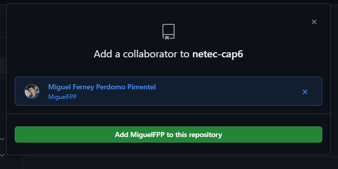
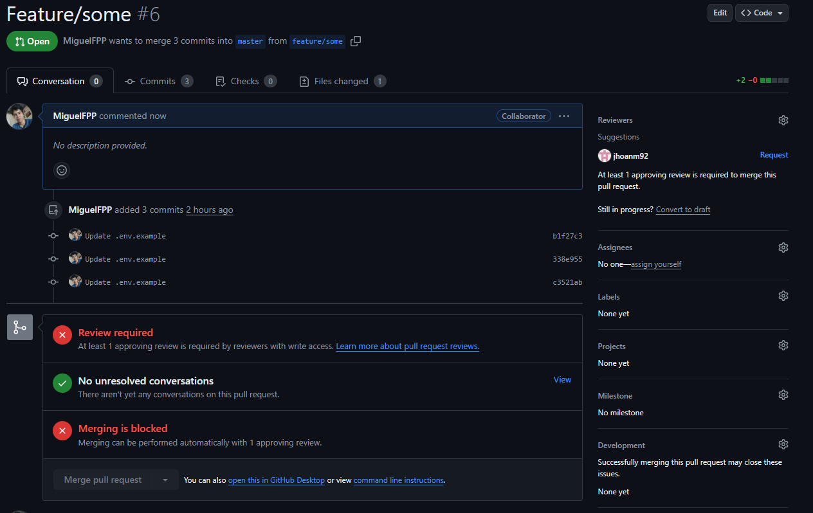
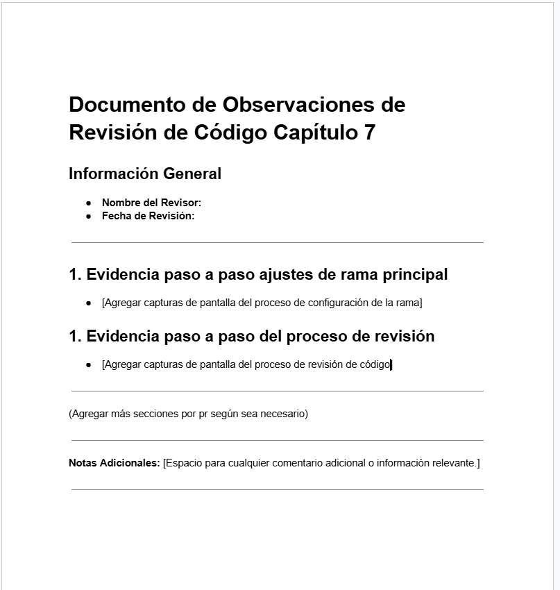

# Práctica 7. Configuración de la herramienta revisión de código

## Objetivo de la práctica:
Al finalizar la práctica, serás capaz de:
- Configurar correctamente la protección de la rama principal de un repositorio en GitHub.
- Invitar y gestionar colaboradores en el repositorio.
- Practicar el proceso completo de revisión de código, incluyendo la creación de pull requests, revisión, solicitud de cambios y aprobación final.

## Objetivo Visual: 

## Duración aproximada:
- 20 minutos.

## Tabla de ayuda:

| Requisito | Descripción|
| --- | --- |
| GitHub Account | Cuenta activa para acceder al repositorio y revisar pull requests. |
| GitHub Desktop | Herramienta opcional para clonar y gestionar el repositorio localmente. |
| Laragon | Herramienta para iniciar servicios de PHP, Apache y MySQL. |
| Composer | Utilizado para instalar Laravel y sus dependencias. Incluido en Laragon. |
| Editor de Código | Recomendado para modificar archivos (ej. Visual Studio Code). |
| Terminal/Comando CLI | Necesario para ejecutar comandos de Git y Laravel. |
| PHP8 y MySQL | Lenguaje y base de datos utilizados en el proyecto Laravel. Incluidos en Laragon. |
| Correo Electrónico | Acceso al correo electrónico asociado a la cuenta de GitHub para aceptar la invitación como colaborador y recibir notificaciones sobre las revisiones. |
| Permisos de Propietario | Permisos necesarios en GitHub para configurar la protección de ramas y gestionar pull requests en el repositorio. |
| Documento de Evaluación | Herramienta para documentar las observaciones (puede ser un archivo de texto o similar). Formato en sección documentos correspondiente a este capítulo. |

## Instrucciones: 

> [!IMPORTANT]
> En esta actividad, el compañero invitado al repositorio será el autor del código y, quien invitó, será quien realizará la revisión o el revisor.

**Paso 1.** Invita como colaborador a uno de nuestros compañeros al repositorio que creaste en la actividad del anterior capítulo.

Ingresa al apartado **"Settings"** de tu repositorio y da clic a **"Collaborators"**.

Da clic a **"Add people"**.

Busca el nombre de usuario GitHub de tu compañero, selecciónalo y agrégalo dando clic en **"Add 'user' to this repository"**.

Tu compañero recibirá un email al correo de su cuenta de GitHub, el cual deberá aceptar para poder ingresar al repositorio.

**Paso 2.** Tu compañero deberá clonar el repositorio en su máquina y lo agregará en GitHub Desktop.

        git clone <url repositorio>

**Paso 3.** Una vez que tu compañero tenga acceso como **Colaborador**, podrá hacer cambios. Primero, crear una rama y publicarla.

Proporciónale un nombre a la rama.

Después, publica la rama.

**Paso 4.**  Una vez creada la rama en el editor de código, busca el archivo **"resource/views/user/index.blade.php"** para realizar una pequeña modificación, y haz commit y push para que esté en el remoto.

**Paso 5.**  Después, realiza el pull request a la rama principal del repositorio al que te dieron acceso.

**Paso 6.** El dueño del repositorio podrá visualizar el pull request y aprobarlo, dando por finalizada esta primera parte.

**Paso 7.** Como segunda parte, el dueño de cada repositorio debe crear una regla para la rama principal, esto con el fin de limitar las pull requests a la rama principal.

En la sección de **"Setting"** del repositorio, da clic a **"Branchs"**.

Después, da clic al botón **"Add classic branch protection rule"**, en esta sección selecciona las opciones de configuración para las ramas.

* Posteriormente, en la nueva vista, escribe la rama que quieres proteger, en este caso: **"master"**.
* Selecciona **"Require pull request before mergin"**, esto hará que sea necesario sí o sí una pull request para hacer merge con la rama principal.
* "Require approvals": en este caso selecciona: **1**. Ten en cuenta que aplica únicamente si no hay cambios pendientes en la revisión.

* **"Require conversation resolution before merging"**: con esta opción es obligatorio que todas la solicitudes hechas por el revisor en líneas de código sean resueltas.

Finalmente, da clic a **"Create"**.

Esto te llevará nuevamente a la configuración de las ramas, donde puedes observar que se ha aplicado una regla.

**Paso 8.** Ahora que aplicaste la regla para tu rama, tu compañero que tiene acceso al repositorio, debe crear una rama en la que hará cambios simulando un error y hará pull request de este cambio.

Ahora notarás como autor del cambio que no puedes aprobar el pull request y, en la sección de Reviewers, está seleccionado por defecto el dueño del repositorio, por lo que es necesario de la aprobación de él.

En caso de haber mas miembros de equipo podríamos cambiar el reviewer o agregar a otros.

Por lo que en este momento debemos esperar a que nuestro compañero dueño del repositorio haga su revisión.

**Paso 9.** El dueño del repositorio hará la revisión desde "file changed", en este caso como se busca simular un error, se deberá comentar el fragmento de código y enviar la revisión.

El dueño del repositorio, comentará el fragmento de código que simula como error.

Después finalizará la revisión agregando un comentario y seleccionando la opción de "request changes", haciendo referencia a la solicitud de cambios, finalmente dando click a "Submit review".

Ahora veremos en la sección "comments" que la sección de "No unresolved conversations", ya no es válida como al inicio ya que también hay cambios pendientes.

Por lo que se tendrán que resolver dichos cambios, para poder marcar la revisión como aprobada y así hacer el merge.

**Paso 10.** El autor del cambio, ahora desde local tendrá que cambiar la línea solicitada y hacer push de ese cambio.

**Paso 11.** El autor del cambio, en la sección de comentarios comentará que está listo y lo marcará como resuelto desde "Resolve conversation".

De esta forma cerraremos la solicitud de cambios.

**Paso 12.** Una vez que esté el cambio solicitado, el dueño del repo podrá verificar desde "files changed" nuevamente, y en este caso aprobar el pull request.

Y notaremos tanto autor como dueño, que ya están habilitadas las opciones de merge, por que se resolvió la solicitud de cambios, y se aprobó el pull request desde la revisión.

**Paso 13.** Ya que se aprobó ya sea el dueño o el autor de los cambios podrá hacer el merge para unificar los cambios con la rama principal.

> [!NOTE]
> Cabe recalcar que todo este proceso de solicitud de cambios será notificado en las cuentas de correo, las solicitudes de cambio, los comentarios y la aprobación.

### Resultado final:

Documento en el que se evidenciará el cómo realizó el ajuste de ramas para la seguridad del pull request y revisión de código obligatorio. Como también evidencia del proceso de revisión de código.

